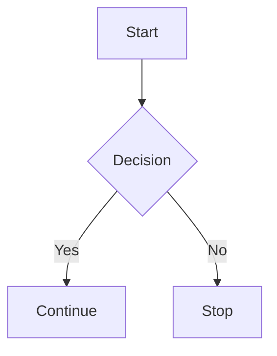
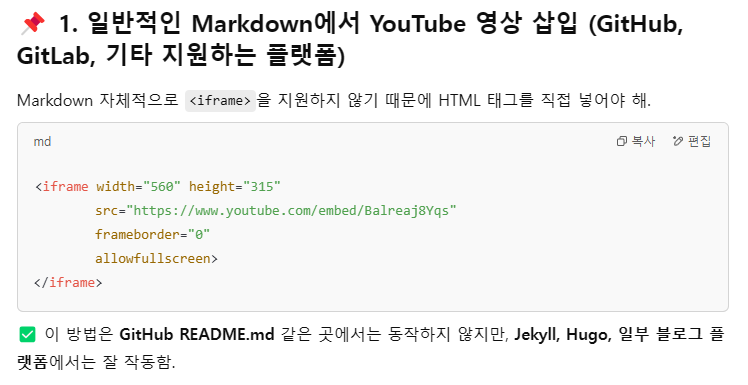
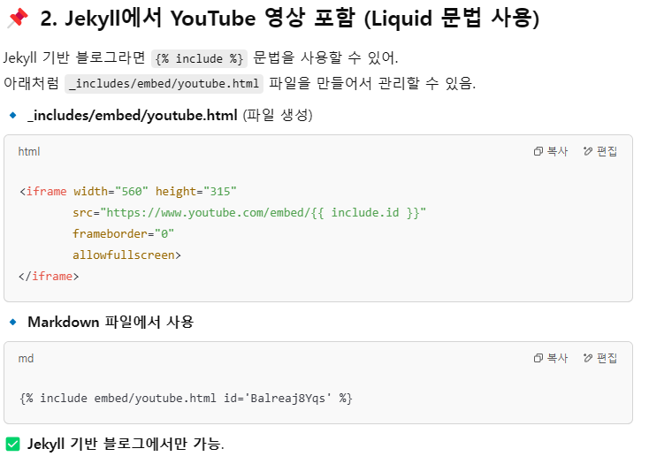
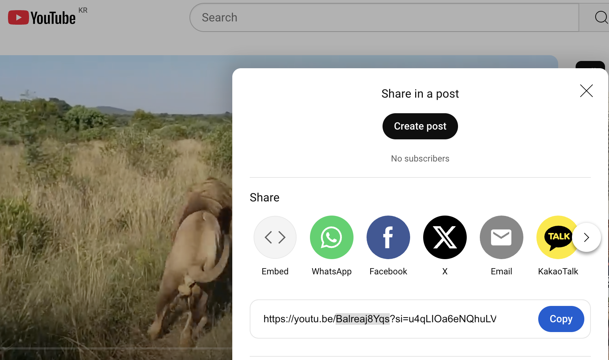

## Github Chirpy Theme Blog Starter
예전부터 만들고 싶었던 깃허브 블로그를 드디어 만들었다!!

처음엔 그냥 구글에 검색하면 맨 위에 나오는 [한국어 블로그](https://wlqmffl0102.github.io/posts/WritingThe-First-post-1-Markdown-Grammar1/ "Dodev님 블로그") 보고 무작정 따라했는데 jekyll build 단계예서 자꾸 오류가 뜨는 것이다ㅠㅠ

며칠동안 씨름하다가 jekyll theme [원작자의 tutorial](https://chirpy.cotes.page/posts/getting-started/ "chirpy.cotes") 이 있다는 것을 알게 되었다 (두둥)

특별한 이유가 있지 않는 이상 theme 을 직접 fork하지 말고 starter를 쓰라는 것도...

fork한 리포 버리고 starter 쓰니까 너무나 쉽게 만들어졌다. 


웬만하면 [원작자 가이드](https://chirpy.cotes.page/)를 보고 시작하고 그 외에 막히는 것 (e.g. 마크다운언어)이 있으면 한국어 블로그를 보시길!

참고로 원작자 가이드 페이지의 source code 는 [**여기서**](https://github.com/cotes2020/jekyll-theme-chirpy/tree/master/_posts) 확인할 수 있다.

마크다운언어가 아닌 마크업(html)언어로 블로그 포스팅을 할 사람들은 [text-and-typography raw file](https://github.com/cotes2020/jekyll-theme-chirpy/blob/master/_posts/2019-08-08-text-and-typography.md)이랑 가이드 사이트를 비교해보면서 따라해 보면 도움이 많이 될 것 같다!

그리고 Front Matter로 Jekyll theme 에서 page (or file) 에 대한 메타데이터를 설정하는데 default configuration 이외에 user가 manually customized variable 을 추가 혹은 기존의 variable의 default value (e.g. image, description) 를 override 할 수 있다는 것을 알게 되었다.

다음 깃허브 블로그 포스트에는 Prompts, Tables, Mathematics, Float to left/right, video, Reverse Footnote, Mermaid SVG 등을 추가하는 법을 배워서 써봐야 겠다.

이것까지하면 벌써 포스팅 3개째 성공이다 아싸

아자아자화이팅이다

<br>
---

## 20250204 update: Advanced Contents
우와 수식이랑 mermaid diagram 되게하려고 _config.yml 계속 고치고 구글에도 엄청 찾아봤는데 되게 복잡하게 이런저런 파일이랑 코드 추가하라 그러는데 도무지 아닌거 같았다. 

starter repo 가 원본에서 inherit 된거 아닌가? 그걸 덮어쓰는 파일을 잘 못 만들었다가 다시 영영 되돌아가지 못하면 우째. 

원본 repo 보니까 mathjax.js 파일이 이미 있어서 그걸 쓰기만 하면 되는 거 같았다. 

정확한 원리는 모르겠지만 내 직감이 맞았던 것 같다. 그냥 Frontmatter 에 각각 한줄씩만 추가해서 있는 코드 작동시키면 되는 거였거든...ㅜ ~바본가 나~

`math=true`

`mermaid=true`

yaml file 수정하라길래 계속 config에서 뭐 바꿔야 하는 줄 알았지...

그 외에 이것저것 쓰는 법을 배웠다. 

다음에는 [이 분 블로그](https://www.handongbee.com/posts/GitHub-Blog-%EC%8B%9C%EC%9E%91%ED%95%98%EA%B8%B0/) 랑 [이 분 블로그](https://wlqmffl0102.github.io/) 를 보면서 1) 구글 아날리틱스로 방문자수 조회, 2) 구글 에드센스로 광고게시, 3) Disqus 댓글 창 열기 등을 알아보아야 겠다. 휴우,,, 힘들다

### Prompts 예시

<!-- markdownlint-capture -->
<!-- markdownlint-disable -->
> An example showing the `tip` type prompt.
{: .prompt-tip }

> An example showing the `info` type prompt.
{: .prompt-info }

> An example showing the `warning` type prompt.
{: .prompt-warning }

> An example showing the `danger` type prompt.
{: .prompt-danger }
<!-- markdownlint-restore -->

### Tables 

| Company                      | Contact          | Country |
| :--------------------------- | :--------------- | ------: |
| Alfreds Futterkiste          | Maria Anders     | Germany |
| Island Trading               | Helen Bennett    |      UK |
| Magazzini Alimentari Riuniti | Giovanni Rovelli |   Italy |

### Links

<http://127.0.0.1:4000>

### Footnote

Click the hook will locate the footnote[^footnote], and here is another footnote[^fn-nth-2].

### code(/text) block
#### Specific filename
> 보통 특정 프로그래밍언어 코드블락이면 "```" 바로 뒤에 언어를 명시하면 되는데 파일명이면 약간 명시하는 법이 다르다.
{: .prompt-tip }

```sass
@import
  "colors/light-typography",
  "colors/dark-typography";
```
{: file='_sass/jekyll-theme-chirpy.scss'}

### Mathematics

The mathematics powered by [**MathJax**](https://www.mathjax.org/):

$$
\begin{equation}
  \sum_{n=1}^\infty 1/n^2 = \frac{\pi^2}{6}
  \label{eq:series}
\end{equation}
$$

We can reference the equation as \eqref{eq:series}.

When $ a\ne0 $ , there are two solutions to $ ax^2 + bx + c = 0 $ and they are

$$ x = {-b \pm \sqrt{b^2-4ac} \over 2a} $$

### Mermaid SVG
> GPT에 'diagram 이미지를 주고 mermaid diagram 으로 나올 수 있게 markdown language 로 코드 작성해줘! github jekyll blog에 post 할 거야' 라고 부탁해보자.
{: .prompt-tip }



### Images

### Default (with caption)

{: width="972" height="589" }
_Full screen width and center alignment_

### Left aligned

{: width="972" height="589" .w-75 .normal}

### Float to left

{: width="972" height="589" .w-50 .left}
Praesent maximus aliquam sapien. Sed vel neque in dolor pulvinar auctor. Maecenas pharetra, sem sit amet interdum posuere, tellus lacus eleifend magna, ac lobortis felis ipsum id sapien. Proin ornare rutrum metus, ac convallis diam volutpat sit amet. Phasellus volutpat, elit sit amet tincidunt mollis, felis mi scelerisque mauris, ut facilisis leo magna accumsan sapien. In rutrum vehicula nisl eget tempor. Nullam maximus ullamcorper libero non maximus. Integer ultricies velit id convallis varius. Praesent eu nisl eu urna finibus ultrices id nec ex. Mauris ac mattis quam. Fusce aliquam est nec sapien bibendum, vitae malesuada ligula condimentum.

### Float to right

{: width="972" height="589" .w-50 .right}
Praesent maximus aliquam sapien. Sed vel neque in dolor pulvinar auctor. Maecenas pharetra, sem sit amet interdum posuere, tellus lacus eleifend magna, ac lobortis felis ipsum id sapien. Proin ornare rutrum metus, ac convallis diam volutpat sit amet. Phasellus volutpat, elit sit amet tincidunt mollis, felis mi scelerisque mauris, ut facilisis leo magna accumsan sapien. In rutrum vehicula nisl eget tempor. Nullam maximus ullamcorper libero non maximus. Integer ultricies velit id convallis varius. Praesent eu nisl eu urna finibus ultrices id nec ex. Mauris ac mattis quam. Fusce aliquam est nec sapien bibendum, vitae malesuada ligula condimentum.

### Dark/Light mode & Shadow
> jekyll은 jpg, jpeg 파일도 지원한다.
{: .prompt-tip }

아래의 이미지는 dark/light mode 에 따라 슬픔이<->기쁨이로 왔다갔다 한다.

{: .light .w-75 .shadow .rounded-10 w='1212' h='668' }
{: .dark .w-75 .shadow .rounded-10 w='1212' h='668' }

### Video
> 여기서 iframe은 원본 repo에 있고 나는 {%...로 시작하는 축약된 syntax 에 따라 id 만 입력하면 되나보다.
{: .prompt-tip }




_Drag해서 Highlight 된 부분이 id 값이다_



### Reverse Footnote
> footnote 는 raw file에 어디 위치되던지 항상 페이지의 맨 아래에 display 된다
{: .prompt-tip }

[^footnote]: The footnote source
[^fn-nth-2]: The 2nd footnote source
