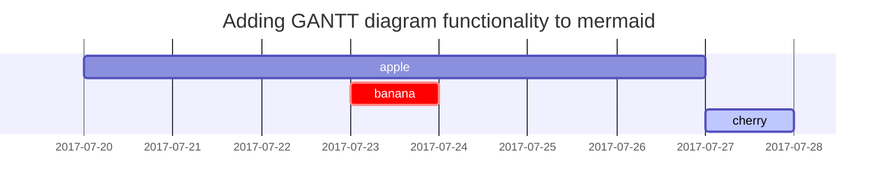

예전부터 만들고 싶었던 깃허브 블로그를 드디어 만들었다!!

처음엔 그냥 구글에 검색하면 맨 위에 나오는 [한국어 블로그](https://wlqmffl0102.github.io/posts/WritingThe-First-post-1-Markdown-Grammar1/ "Dodev님 블로그") 보고 무작정 따라했는데 jekyll build 단계예서 자꾸 오류가 뜨는 것이다ㅠㅠ

며칠동안 씨름하다가 jekyll theme [원작자의 tutorial](https://chirpy.cotes.page/posts/getting-started/ "chirpy.cotes") 이 있다는 것을 알게 되었다 (두둥)

특별한 이유가 있지 않는 이상 theme 을 직접 fork하지 말고 starter를 쓰라는 것도...

fork한 리포 버리고 starter 쓰니까 너무나 쉽게 만들어졌다. 


웬만하면 [원작자 가이드](https://chirpy.cotes.page/)를 보고 시작하고 그 외에 막히는 것 (e.g. 마크다운언어)이 있으면 한국어 블로그를 보시길!

참고로 원작자 가이드 페이지의 source code 는 [**여기서**](https://github.com/cotes2020/jekyll-theme-chirpy/tree/master/_posts) 확인할 수 있다.

마크다운언어가 아닌 마크업(html)언어로 블로그 포스팅을 할 사람들은 [text-and-typography raw file](https://github.com/cotes2020/jekyll-theme-chirpy/blob/master/_posts/2019-08-08-text-and-typography.md)이랑 가이드 사이트를 비교해보면서 따라해 보면 도움이 많이 될 것 같다!

그리고 Front Matter로 Jekyll theme 에서 page (or file) 에 대한 메타데이터를 설정하는데 default configuration 이외에 user가 manually customized variable 을 추가 혹은 기존의 variable의 default value (e.g. image, description) 를 override 할 수 있다는 것을 알게 되었다.

다음 깃허브 블로그 포스트에는 Prompts, Tables, Mathematics, Float to left/right, ㅍideo, Reverse Footnote, Mermaid SVG 등을 추가하는 법을 배워서 써봐야 겠다.

이것까지하면 벌써 포스팅 3개째 성공이다 아싸

아자아자화이팅이다
## 20250204 update

## Prompts

<!-- markdownlint-capture -->
<!-- markdownlint-disable -->
> An example showing the `tip` type prompt.
{: .prompt-tip }

> An example showing the `info` type prompt.
{: .prompt-info }

> An example showing the `warning` type prompt.
{: .prompt-warning }

> An example showing the `danger` type prompt.
{: .prompt-danger }
<!-- markdownlint-restore -->

## Tables

| Company                      | Contact          | Country |
| :--------------------------- | :--------------- | ------: |
| Alfreds Futterkiste          | Maria Anders     | Germany |
| Island Trading               | Helen Bennett    |      UK |
| Magazzini Alimentari Riuniti | Giovanni Rovelli |   Italy |

## Links

<http://127.0.0.1:4000>

## Footnote

Click the hook will locate the footnote[^footnote], and here is another footnote[^fn-nth-2].

### Specific filename

```sass
@import
  "colors/light-typography",
  "colors/dark-typography";
```
{: file='_sass/jekyll-theme-chirpy.scss'}

## Mathematics

The mathematics powered by [**MathJax**](https://www.mathjax.org/):

$$
\begin{equation}
  \sum_{n=1}^\infty 1/n^2 = \frac{\pi^2}{6}
  \label{eq:series}
\end{equation}
$$

We can reference the equation as \eqref{eq:series}.

When $a \ne 0$, there are two solutions to $ax^2 + bx + c = 0$ and they are

$$ x = {-b \pm \sqrt{b^2-4ac} \over 2a} $$

## Mermaid SVG



## Images

### Default (with caption)

{: width="972" height="589" }
_Full screen width and center alignment_

### Left aligned

{: width="972" height="589" .w-75 .normal}

### Float to left

{: width="972" height="589" .w-50 .left}
Praesent maximus aliquam sapien. Sed vel neque in dolor pulvinar auctor. Maecenas pharetra, sem sit amet interdum posuere, tellus lacus eleifend magna, ac lobortis felis ipsum id sapien. Proin ornare rutrum metus, ac convallis diam volutpat sit amet. Phasellus volutpat, elit sit amet tincidunt mollis, felis mi scelerisque mauris, ut facilisis leo magna accumsan sapien. In rutrum vehicula nisl eget tempor. Nullam maximus ullamcorper libero non maximus. Integer ultricies velit id convallis varius. Praesent eu nisl eu urna finibus ultrices id nec ex. Mauris ac mattis quam. Fusce aliquam est nec sapien bibendum, vitae malesuada ligula condimentum.

### Float to right

{: width="972" height="589" .w-50 .right}
Praesent maximus aliquam sapien. Sed vel neque in dolor pulvinar auctor. Maecenas pharetra, sem sit amet interdum posuere, tellus lacus eleifend magna, ac lobortis felis ipsum id sapien. Proin ornare rutrum metus, ac convallis diam volutpat sit amet. Phasellus volutpat, elit sit amet tincidunt mollis, felis mi scelerisque mauris, ut facilisis leo magna accumsan sapien. In rutrum vehicula nisl eget tempor. Nullam maximus ullamcorper libero non maximus. Integer ultricies velit id convallis varius. Praesent eu nisl eu urna finibus ultrices id nec ex. Mauris ac mattis quam. Fusce aliquam est nec sapien bibendum, vitae malesuada ligula condimentum.

### Dark/Light mode & Shadow

The image below will toggle dark/light mode based on theme preference, notice it has shadows.

{: .light .w-75 .shadow .rounded-10 w='1212' h='668' }
{: .dark .w-75 .shadow .rounded-10 w='1212' h='668' }

## Video



## Reverse Footnote

[^footnote]: The footnote source
[^fn-nth-2]: The 2nd footnote source


