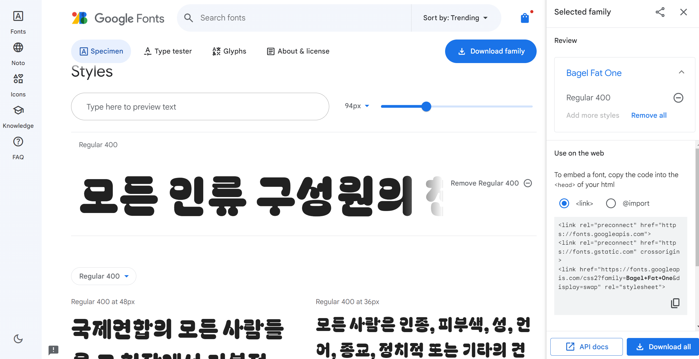
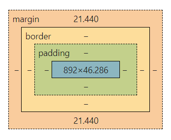

# Intro to CSS

## ❶ How to Add CSS

### 1. Inline CSS
- **Single Element**  

    ```html
    <html style="background: blue;"></html>
    <body style="background: blue;"></body>
    <body style="background: #D8B6A4;"></body>
    ```

> ❌ Obsolete: forces us to add styling for each element manually
{: .prompt-warning }
> ✅ Only use for testing
{: .prompt-tip }

---

### 2. Internal CSS
- Can apply **anywhere** in the HTML document; convention is inside the `<head>`.
- Works for **single webpages** but **not multi-page websites**.

    ```html
    <html> 
      <head> 
        <style> 
          html { background: red; } 
          body { color: white; } 
        </style>
      </head> 
    </html>
    ```

---

### 3. External CSS
- **Best for multi-page websites**  
- **Most commonly used method**  

    ```html
    <link rel="stylesheet" href="./styles.css" />
    ```

---

## ❷ CSS Selectors

### 1. Element Selector
- Targets **HTML tag names** (e.g., `h1`, `body`, `a`).
- Applies to **all elements** of that type.

    ```css
    body { color: red; }
    ```

---

### 2. Class Selector
- `class` and `id` are **HTML attributes**.

    ```html
    <h2 class="red-text">Heading 2</h2>
    <p class="red-text">Paragraph</p>
    ```

    ```css
    .red-text { color: red; }
    ```

- **Pseudo-Class:** Used for different states of an element.

    ```css
    img:hover { background-color: gold; }
    ```

---

### 3. ID Selector
⚠ **Use sparingly**  
- IDs are **unique** and should not be overused.

    ```html
    <p id="main">Paragraph</p>
    ```

    ```css
    #main { color: red; }
    ```

---

### 4. Attribute Selector

    ```html
    <p draggable="true">Drag me</p>
    <p draggable="false">Don't drag me</p>
    ```

    ```css
    p[draggable] { color: red; } /* Selects all <p> elements with draggable attribute */
    p[draggable="false"] { color: red; } /* Selects only <p> elements with draggable="false" */
    ```

---

### 5. Global Selector
- Selects **all elements**.

    ```css
    * { color: red; }
    ```

---

## ❸ ID vs. Class Differences

| Feature | ID | Class |
|---------|----|-------|
| Multiple instances of the same identifier | ❌ No | ✅ Yes |
| Identifies unique elements on a page | ✅ Yes | ❌ No |
| Groups related elements for styling | ❌ No | ✅ Yes |
| Multiple classes or IDs for one element | ❌ No | ✅ Yes |

    ```html
    <!-- Incorrect (Multiple IDs) -->
    <h1 id="egg circle">This won't work</h1>

    <!-- Correct (Multiple Classes) -->
    <h1 class="egg circle">This works</h1>
    ```

---

### ID vs. Class Similarities
- Some HTML tags have **predefined browser styles**.
- CSS does **not** differentiate between ID and class syntax-wise.

===

# CSS Properties

## CSS Specificity
The lower the hierarchy, the more power to overwrite style rules.

| Priority | Example | 
|----------|---------|
| Inline style | <h1 style="color: pink;"> | 
| Id selectors | #navbar | 
| Classes (or pseudo-classes) | .test, :hover | 
| Attributes | [type="text"] | 
| Elements (or pseudo-elements) | h1, ::before, ::after |


---

## CSS Colors
### Resources 🪚
- [Color Palette](http://colorhunt.co/)
- [Generate Unique Color](https://www.csfieldguide.org.nz/en/interactives/rgb-mixer/)
- [CSS Named Colors](https://developer.mozilla.org/en-US/docs/Web/CSS/named-color)

---

## Font Properties
### Font Size
- `1px` = 1/96th inch
- `1pt` = 1/72nd inch
- `1em` = 100% of parent (RELATIVE SIZE)
- `1rem` = 100% of root (RELATIVE SIZE)
  - Root is normally the `html` element.
  - `rem` is preferred over `em`.

### Font Weight
- Use keywords: `normal`, `bold`
- Relative to parent: `lighter`, `bolder`
- Numeric values: `100-900`

### Font Family
```css
html {
  font-family: Arial, Helvetica, sans-serif;
}
h1 {
  font-family: 'Times New Roman', Times, serif;
}
```
- Put quotation marks if the font name has spaces.
- [Google Fonts](https://fonts.google.com/?subset=korean&noto.script=Kore)
- 

---

## Inspecting CSS (Ft. Google Developer Tool)
- **Style tab**: Can check boxes or add CSS properties.
- **Computed tab**: Convenient to check which properties actually got applied when there are overwrites.
- **CSS Overview tab**: Summary of designs (go to "More").
- **Try changing values** on the box model: margin, border, etc., and overwrite browser-default styles.

---

## The CSS Box Model - Margin, Padding, and Border


1. **Padding** increases the gap between the content box and the border.
   - Only pads the content; does not affect background images or background color.
2. **Border weight** can be increased or changed in style.
3. **Margin** increases the buffer (the gap from other elements).
   - Affects the space **outside the border**.

> ⚠️ **None of these affect the size of the content box; They grow size OUTWARD.**
{: .prompt-warning }

### HTML `div` element:
- Divides contents into separate containers and affects the layout of each container.
- Doesn't do anything unless CSS styling is applied (similar to `span`).

### Border Width Rules
#### 1. When you have 4 values:
Values apply **clockwise** from **top → right → bottom → left**
```css
p {
  border-width: 0 1em 2em 3em;
}
```
#### 2. When you have 2 values:
Values apply **top & bottom** and **left & right**
```css
p {
  border-width: 1em 3em;
}
```
#### 3. When you have 1 value:
Value applies to **all 4 sides**
```css
p {
  border-width: 0;
}
```

### Notes
- You can set multiple styles in a single line; **Order does NOT matter**
```css
{ border: solid 10px white; }
```

### Resources 🪚
- [Pesticide Chrome Extension](https://chrome.google.com/webstore/detail/pesticide) (Hold down Control key and hover over different boxes).

<br>
<footer>
본 후기는 [한글과컴퓨터x한국생산성본부x스나이퍼팩토리] 한컴 AI 아카데미 (B-log) 리뷰로 작성 되었습니다.
<br>
#한컴AI아카데미 #AI개발자 #AI개발자교육 #한글과컴퓨터 #한국생산성본부 #스나이퍼팩토리 #부트캠프 #AI전문가양성 #개발자교육 #개발자취업
</footer>
